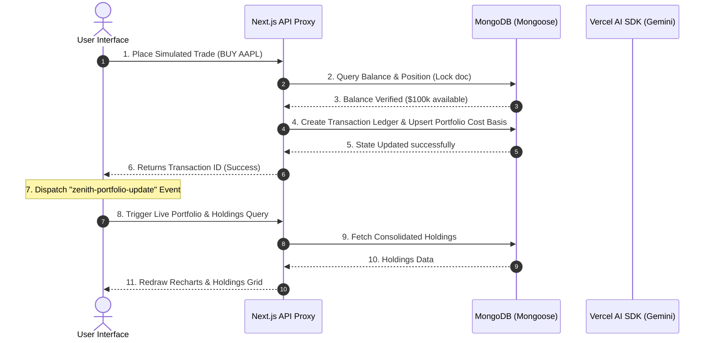

# Zenith Platform Evaluation & Architecture Audit

This document provides a comprehensive evaluation of the Zenith Platform's current architecture, system features, and development roadmaps, highlighting our recent type-safety overhauls and simulated paper-trading modules.

---

## 1. System Architecture

### Frontend (Next.js 15 App Router)
- **Framework**: Next.js 15 App Router with Turbopack for extremely fast builds, hot module reloading, and server-side rendering (SSR/RSC) capabilities.
- **Styling & Theme**: Strictly structured Tailwind CSS v4 enforcing a dark-mode, high-contrast "Tactile Brutalist" aesthetic (0px border-radius, monospace technical fonts, sharp raw borders, and signature high-contrast highlight colors).
- **Routing**: Clean route isolation utilizing Next.js route groups (`(auth)` for authentication pages, `(marketing)` for the editorial brutalist landing page, and `(root)` for the central authenticated investment terminal shell).
- **UI & Accessibility**: Utilizes Radix UI primitives via Shadcn for accessible, keyboard-navigable interface controls.

### Backend & Event Pipeline (Next.js API & Inngest)
- **Serverless API Routes**: Dynamic REST endpoints and streaming Server-Sent Events (SSE) handling micro-services (e.g. `/api/market/quote`, `/api/stock-chat`).
- **Asynchronous Background Jobs**: Event-driven architecture powered by **Inngest**. Seamlessly offloads heavy generative AI tasks (such as daily watchlist critiques and personalized welcome email compilation) to background processes, ensuring zero serverless function timeouts.

### Database & Authentication
- **Database**: MongoDB via Mongoose object modeling. Optimized with compound indexes (e.g. `{ userId: 1, symbol: 1 }` on watches and portfolio collections) to ensure instant, transactionally consistent reads and writes.
- **Authentication**: **Better Auth** framework. Directly integrated with Mongoose adapters, replacing legacy NextAuth configurations, and safely injecting user session metadata (such as simulated `virtualBalance`) directly into active headers.

---

## 2. Detailed Current Unified Architecture

Our recent updates successfully consolidated the financial ledger and real-time AI tools into one cohesive, clean-compiled system:

### A. The Event-Driven Paper Trading Ledger
Simulated order execution is designed as an immutable ledger to mimic professional exchange backends:
1. **Order Initiation**: The user interacts with the `<OrderPanel />` to submit a virtual BUY or SELL order.
2. **Quote Verification**: The panel queries `/api/market/quote` to retrieve the current mock or real asset price.
3. **Transaction Server Action**: Calls `executeTrade` to insert a Mongoose `Transaction` record as `PENDING`.
4. **Balance & Inventory Guards**: Checks Mongoose collections to verify the user has sufficient cash (for BUY) or sufficient shares (for SELL). If checks fail, status is saved as `FAILED`.
5. **Atomic Ledger Resolution**: Atomically decrements/increments the user's `virtualBalance` in the `user` collection, updates the target position average cost-basis and quantity in the `Portfolio` collection, and marks the Transaction record as `COMPLETED`.
6. **Reactive State Sync (Event Bus)**: On success, the UI triggers a browser-wide custom event (`window.dispatchEvent(new Event("zenith-portfolio-update"))`). All active holdings widgets, summary banners, and Recharts performance charts on the page listen to this event and dynamically pull fresh data from the server, creating a highly responsive user experience.

### B. Dual-Layout Responsive Workspaces
Following competitive research on professional terminals (Koyfin/TradingView), we implemented a persistent dual-layout engine inside our ticker execution panel:
* **Inline Bento Grid Card Layout**: Standard layout that acts as a native grid slot side-by-side with TradingView interactive charts.
* **Sliding Right Sidebar Layout**: Slides in as a right-edge viewport drawer to keep focus entirely on visual chart analysis.
* **Layout Persistence**: Synchronized in real-time with `localStorage` (`zenith_order_panel_layout`) to ensure layout preferences remain consistent across browser reloads.

### C. Strictly Typed AI Grounding Pipeline
The platform leverages the `@ai-sdk/google` integration alongside standard TypeScript safety rules:
* **Strict Interface Assertions**: Removed all forbidden `any` typecasts in API routes and Recharts tooltip handlers, replacing them with strongly typed custom interfaces (`NodeData`, `TooltipPayloadItem`, `StockData`, `ChatMessage`).
* **Live Search news Grounding**: Movement explainers and Watchlist critics automatically run search scripts (`duck-duck-scrape`) restricted to credible financial news sources.
* **AI Failover Routine**: Generative tasks target `gemini-3.1-flash-lite` for high-speed, cost-efficient processing, with automatic fallback routing to `gemini-3.5-flash` in the event of rate limiters or credentials errors.

---

## 3. Feature Performance Audit

| Feature Area | Architectural Strength | Evaluation Status |
| :--- | :--- | :--- |
| **Simulated Trading Slip** | Atomic balance guards + dual layout | **Operational (High Performance)** |
| **Interactive Dashboard** | Recharts Net Worth area chart + active grids | **Operational (Live-Syncing)** |
| **AI Movement Explainer** | DuckDuckGo search news synthesis + Gemini fallback | **Operational (Zero Emojis)** |
| **AI Watchlist Critic** | Auto-triggered bento card portfolio audit | **Operational (Brutalist)** |
| **FTE Walkthrough Tour** | driver.js with custom brutalist CSS overlays | **Operational (Clean)** |
| **Background Automation** | Inngest cron workers & welcome SMTP queues | **Operational (Async)** |
| **Linter & Build Health** | Shared bundles < 150kB + 0 ESLint errors | **Passed (Clean)** |
