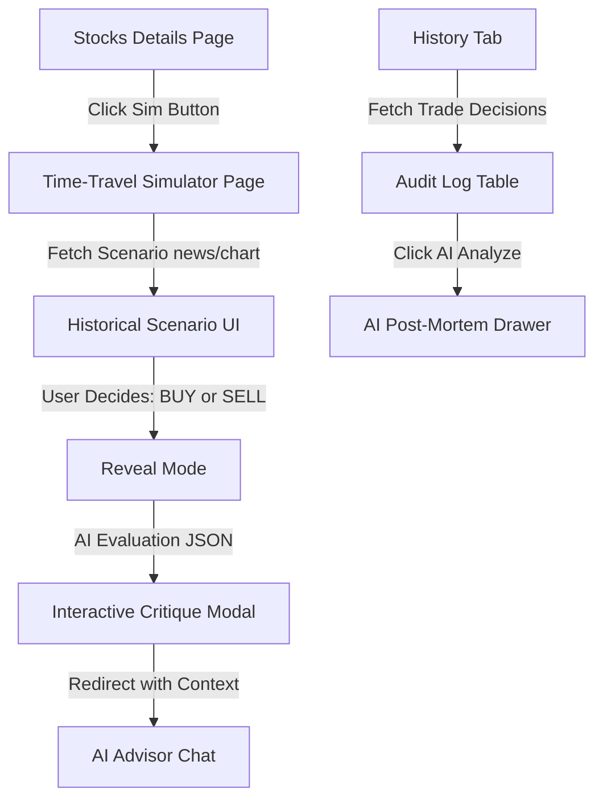

# Zenith Platform: Current System Audit & Future Features Roadmap

This document outlines the current state of key platform subsystems, details fixes for active bugs, explains the architecture of the simulated paper ledger, and provides complete implementation designs for two major future features: the **Time-Travel Stock Decision Simulator** and the **Decision Audit History Log**.

---

## Part 1: Current System Audit & Debugging Report

### 1. Seed Data Portfolio showing $0 instead of $100,000
#### The Cause
The initial `$100,000` virtual balance is configured as a custom schema field on the Better Auth user model with a default value of `100000` (located in [auth.ts](file:///d:/zenith-ai/lib/better-auth/auth.ts#L27-L31)). 
However, for users created prior to the schema update, or if the MongoDB collection record does not contain the `virtualBalance` field, the application falls back to `0` inside the trading action files:
*   **Portfolio Route**: [app/api/trading/portfolio/route.ts](file:///d:/zenith-ai/app/api/trading/portfolio/route.ts#L24) reads `const virtualBalance = user?.virtualBalance || 0;`.
*   **Trade Execution Action**: [lib/actions/trading.actions.ts](file:///d:/zenith-ai/lib/actions/trading.actions.ts#L29) reads `const virtualBalance = user.virtualBalance || 0;`.

Because the value is `undefined` on the database record, it defaults to `0`, causing the UI to display a `$0.00` virtual balance and locking out users from buying stocks due to "insufficient funds".

#### The Fix
1.  **Code Fallback Safeguard (Recommended)**: Change the fallbacks in both the API route and the server action to fall back to `100000` if the database record is missing the key:
    ```typescript
    // In app/api/trading/portfolio/route.ts and lib/actions/trading.actions.ts
    const virtualBalance = typeof user?.virtualBalance === 'number' ? user.virtualBalance : 100000;
    ```
2.  **Database Migration**: Run the migration script [migrate-virtual-balance.ts](file:///d:/zenith-ai/scripts/migrate-virtual-balance.ts) to populate `virtualBalance: 100000` for all existing users who do not have this field:
    ```bash
    npx ts-node scripts/migrate-virtual-balance.ts
    ```

---

### 2. Where to Start "Sandbox Mode"
#### Explanation
Zenith is **exclusively a paper-trading simulation and educational sandbox** by design. 
Every interface—including the [OrderPanel](file:///d:/zenith-ai/components/trading/OrderPanel.tsx), the [dashboard](file:///d:/zenith-ai/app/%28root%29/dashboard/page.tsx), and the real-time TradingView widgets—operates on simulated, virtual, risk-free portfolios. There is no active brokerage integration, and no real capital is ever deployed.

You are **already in Sandbox Mode immediately upon sign-in**! There is no separate toggle or configuration needed to start paper trading. Once the virtual balance issue (noted above) is fixed, users can immediately begin executing paper positions.

---

### 3. Chatbot/AI Advisor Not Working
#### The Cause
The `/api/stock-chat` route (defined in [route.ts](file:///d:/zenith-ai/app/api/stock-chat/route.ts#L24-L32)) checks for the presence of the `GEMINI_API_KEY` environment variable. If it is not defined, the server immediately returns a `500 Server Configuration Error` to prevent runtime exceptions in LangGraph.
A search of your project environment configuration indicates that **`GEMINI_API_KEY` is missing from the `.env` file**.

#### The Fix
Generate a Gemini API Key from your Google AI Studio dashboard and add it to your local environment file:
```env
# In D:\zenith-ai\.env
GEMINI_API_KEY=your_actual_gemini_api_key_here
```
Once this environment variable is populated and the dev server is restarted, the AI Advisor's multi-agent streaming graph will start successfully.

---

## Part 2: Future Feature Roadmap Specifications

> [!IMPORTANT]
> Both future features must strictly adhere to the **Zenith Dark Tactile Brutalism** design guidelines: 1px high-contrast borders using bone white (`#e5e2e1`), sharp `0px` border-radii, thick offset block-shadows, high-contrast orange highlights (`#ff4f00`), strict TypeScript typing (`noImplicitAny`), and responsive modular layouts.



---

### Feature 1: Time-Travel Stock Decision Simulator
**UX Flow**: A gamified simulation module designed to test a user's trading instincts against historical market anomalies.

```carousel
```html
<!-- Slide 1: Scenario Initial Setup -->
<div class="border border-white p-6 bg-black text-white font-mono">
  <div class="flex justify-between border-b border-white pb-3 mb-4">
    <span class="text-xs text-gray-400">// SCENARIO #042 - TECH BUBBLE EDGE</span>
    <span class="bg-red-600 text-black px-2 text-xs font-bold font-sans">HIGH VOLATILITY</span>
  </div>
  <h2 class="text-xl font-bold text-primary mb-2">COMPANY: CSCO (Cisco Systems)</h2>
  <p class="text-sm text-gray-300 mb-4">The date is March 27, 2000. Cisco Systems has just surpassed Microsoft to become the most valuable company in the world. Leading metrics show massive demand for internet routing hardware.</p>
  <div class="border border-white p-3 bg-gray-900 mb-4">
    <div class="text-xs text-primary mb-1 font-bold">LATEST HEADLINE:</div>
    <div class="text-sm italic">"Cisco Enjoys Infinite Hardware Order Bookings as Dot-Com Boom Reaches Fever Pitch"</div>
  </div>
  <div class="flex gap-4">
    <button class="flex-1 bg-green-600 text-black py-3 font-bold border border-white active:translate-x-1 active:translate-y-1 shadow-[2px_2px_0px_rgba(255,255,255,1)]">BUY SHARES</button>
    <button class="flex-1 bg-red-600 text-black py-3 font-bold border border-white active:translate-x-1 active:translate-y-1 shadow-[2px_2px_0px_rgba(255,255,255,1)]">SELL / SHORT</button>
  </div>
</div>
<!-- Slide 2: Reveal & AI Critique -->
<div class="border border-white p-6 bg-black text-white font-mono">
  <div class="bg-red-950 border border-red-500 text-red-400 p-4 mb-4">
    <div class="font-bold text-sm">DECISION OUTCOME: INCORRECT (-86.4% DEPRECIATION)</div>
    <p class="text-xs mt-1">Cisco peaked on March 27, 2000, and immediately entered a historic multi-year decline due to overbuilt telecom infrastructure and massive supply glut.</p>
  </div>
  <div class="border border-white bg-gray-900 p-4 mb-4">
    <h3 class="text-xs text-primary font-bold mb-2">// COGNITIVE CRITIQUE BY ZENITH CORE AI</h3>
    <ul class="text-xs list-disc pl-4 space-y-2 text-gray-300">
      <li><strong>Multiple Mismatches</strong>: The forward P/E ratio was 130x, which was mathematically unsustainable given long-term semiconductor production curves.</li>
      <li><strong>Insider Sales</strong>: Insider transactions showed strong divergence, with executives selling shares at a rate of 12:1.</li>
    </ul>
  </div>
  <button class="w-full bg-primary text-black py-3 font-bold border border-white">CONSULT AI ADVISOR FOR DEBRIEFING</button>
</div>
```
```

#### Proposed Changes

##### 1. [NEW] [stock-sim-route](file:///d:/zenith-ai/app/api/simulator/scenario/route.ts)
A Next.js serverless route that yields randomized historical trading setups (e.g., Apple in August 1997, Cisco in March 2000, AMD in 2012) including historical chart arrays, news summaries, and the actual future price trajectories.
```typescript
import { NextResponse } from "next/server";

export interface SimulatorScenario {
  id: string;
  symbol: string;
  historicalDate: string;
  headline: string;
  newsSummary: string;
  contextData: {
    peRatio: number;
    insiderSalesRatio: string;
    rsi: number;
  };
  chartHistory: { date: string; price: number }[];
  revealPriceChangePercent: number;
  aiExplanation: {
    correctAction: "BUY" | "SELL";
    points: string[];
    critique: string;
  };
}

export async function GET() {
  // Static scenarios representing historic inflection points
  const scenarios: SimulatorScenario[] = [
    {
      id: "csco-2000",
      symbol: "CSCO",
      historicalDate: "2000-03-27",
      headline: "Cisco Becomes Most Valuable Global Entity",
      newsSummary: "Cisco Systems surpasses Microsoft with a $569B valuation. Insatiable enterprise routing demands fuel exponential growth.",
      contextData: { peRatio: 130, insiderSalesRatio: "12:1 (Sellers)", rsi: 82 },
      chartHistory: [
        { date: "1999-10", price: 34.2 },
        { date: "1999-12", price: 53.8 },
        { date: "2000-02", price: 68.1 },
        { date: "2000-03-27", price: 80.0 }
      ],
      revealPriceChangePercent: -86.4,
      aiExplanation: {
        correctAction: "SELL",
        points: [
          "Extreme valuation divergence: Cisco reached a forward price-to-earnings multiple exceeding 130x.",
          "Insiders aggressively distributed shares into retail hype, signalling near-term peak.",
          "Extreme technical overbought readings: monthly RSI peaked at 82."
        ],
        critique: "Buying at the literal structural apex of the dot-com bubble is a classic FOMO trap. High-volume peaks paired with high insider selling and triple-digit P/E ratios are high-probability short-sale setups."
      }
    }
  ];
  
  const randomScenario = scenarios[Math.floor(Math.random() * scenarios.length)];
  return NextResponse.json(randomScenario);
}
```

##### 2. [NEW] [simulator-page](file:///d:/zenith-ai/app/%28root%29/simulator/page.tsx)
The interactive brutalist game client displaying news headlines, rendering interactive Recharts, collecting decision inputs, and displaying the custom AI critique drawer/modal with an instant "Debrief with AI Advisor" button redirect.

---

### Feature 2: Decision Audit History & Retro Log
**UX Flow**: A performance tracking suite that allows traders to reflect on their simulated executions, with the ability to trigger a post-mortem Gemini review on unprofitable trades.

```html
<div class="border border-white p-6 bg-black text-white font-mono">
  <div class="flex items-center justify-between border-b border-white pb-3 mb-4">
    <span class="text-xs text-primary font-bold">// USER TRANSACTION DECISION LOGS</span>
    <span class="text-xs text-gray-400">TOTAL TRADES COMPLETED: 12</span>
  </div>
  <table class="w-full text-left text-xs border border-white">
    <thead>
      <tr class="bg-gray-900 border-b border-white">
        <th class="p-2 border-r border-white">SYMBOL</th>
        <th class="p-2 border-r border-white">TYPE</th>
        <th class="p-2 border-r border-white">PRICE</th>
        <th class="p-2 border-r border-white">STATUS</th>
        <th class="p-2">ACTION</th>
      </tr>
    </thead>
    <tbody>
      <tr class="border-b border-white">
        <td class="p-2 border-r border-white font-bold">CSCO</td>
        <td class="p-2 border-r border-white text-red-500 font-bold">BUY</td>
        <td class="p-2 border-r border-white">$80.00</td>
        <td class="p-2 border-r border-white"><span class="bg-red-950 text-red-400 px-1 border border-red-500 text-[10px]">UNPROFITABLE</span></td>
        <td class="p-2"><button class="bg-primary text-black px-2 py-1 text-[10px] font-bold border border-white">REQUEST AI AUDIT</button></td>
      </tr>
      <tr>
        <td class="p-2 border-r border-white font-bold">AAPL</td>
        <td class="p-2 border-r border-white text-green-500 font-bold">BUY</td>
        <td class="p-2 border-r border-white">$142.10</td>
        <td class="p-2 border-r border-white"><span class="bg-green-950 text-green-400 px-1 border border-green-500 text-[10px]">PROFITABLE</span></td>
        <td class="p-2"><span class="text-gray-500 italic">Audit Unavailable</span></td>
      </tr>
    </tbody>
  </table>
</div>
```

#### Proposed Changes

##### 1. [NEW] [audit-api](file:///d:/zenith-ai/app/api/trading/audit/route.ts)
A streaming serverless endpoint that hooks up to the transaction logs, retrieves details on the chosen transaction, fetches the historical technical metadata for that period, and sends a prompt to Gemini asking for a detailed technical critique.

```typescript
import { NextRequest, NextResponse } from "next/server";
import { connectToDatabase } from "@/database/mongoose";
import { Transaction } from "@/database/models/transaction.model";
import { GoogleGenAI } from "@google/generative-ai";

export async function POST(req: NextRequest) {
  try {
    const { transactionId } = await req.json();
    if (!transactionId) {
      return NextResponse.json({ error: "Transaction ID is required" }, { status: 400 });
    }

    await connectToDatabase();
    const transaction = await Transaction.findById(transactionId);
    if (!transaction) {
      return NextResponse.json({ error: "Transaction record not found" }, { status: 404 });
    }

    // Call Gemini to generate a technical post-mortem analysis
    const genAI = new GoogleGenAI({ apiKey: process.env.GEMINI_API_KEY || "" });
    const model = genAI.getGenerativeModel({ model: "gemini-3.5-flash" });

    const prompt = `
      Perform an elite financial technical analysis critique on the following simulated trade:
      - Stock: ${transaction.symbol}
      - Action Taken: ${transaction.type}
      - Price: $${transaction.price}
      - Total Order Cost: $${transaction.totalAmount}
      - Status: ${transaction.status}

      Critique the decision using known historical trends for ${transaction.symbol}. Keep the tone extremely professional, brutalist, and objective. Limit your response to 3 precise technical points and a summary conclusion.
    `;

    const result = await model.generateContent(prompt);
    return NextResponse.json({
      success: true,
      auditReport: result.response.text(),
    });
  } catch (err: unknown) {
    return NextResponse.json({ error: err instanceof Error ? err.message : "Internal Error" }, { status: 500 });
  }
}
```

##### 2. [NEW] [history-view](file:///d:/zenith-ai/app/%28root%29/dashboard/history/page.tsx)
A dedicated page utilizing a dense brutalist table interface showing all transaction entries. Next to negative return trades, a "REQUEST AI AUDIT" button triggers the API, launching an overlay slide-out terminal sidebar with real-time text typewriter streaming.

---

## Part 3: Step-by-Step Implementation Plan

### Step 1: Core System Diagnostics & Stabilization
1.  **Configure API Keys**: Add the missing `GEMINI_API_KEY` to the `.env` file to unlock the multi-agent chatbot streaming endpoint.
2.  **Fix Virtual Balance Fallback**: Update [app/api/trading/portfolio/route.ts](file:///d:/zenith-ai/app/api/trading/portfolio/route.ts#L24) and [lib/actions/trading.actions.ts](file:///d:/zenith-ai/lib/actions/trading.actions.ts#L29) to fall back to `100000` so that all users have paper trading funds.
3.  **Run User Collection Migration**: Execute the `migrate-virtual-balance.ts` script to backfill active user records in MongoDB.

### Step 2: Implement the Time-Travel Simulator
1.  **Define Scenario Schema**: Establish TypeScript typing for scenarios (`app/api/simulator/scenario/route.ts`).
2.  **Create Scenic Database/Constant**: Add standard historical inflection records (Tech Bubble 2000, Financial Crisis 2008, COVID bottom 2020).
3.  **Build Scenario UI Grid**: Render a two-column brutalist panel with interactive historical charts, headlines, and massive execution actions.
4.  **Connect AI Critique Engine**: Trigger structured Gemini feedback modal with an immediate redirect to `/stockadvisor` preloaded with the query context.

### Step 3: Implement Decision Audit Logs
1.  **Construct History Dense Table**: Lay out a dense data matrix mapping simulated trades.
2.  **Build Audit API Route**: Deploy `/api/trading/audit` server endpoint executing prompt schemas.
3.  **Deploy Terminal Slide-Out Drawer**: Add a custom slide-out side panel (`components/trading/AuditDrawer.tsx`) to stream Gemini post-mortem technical feedback immediately on screen.
